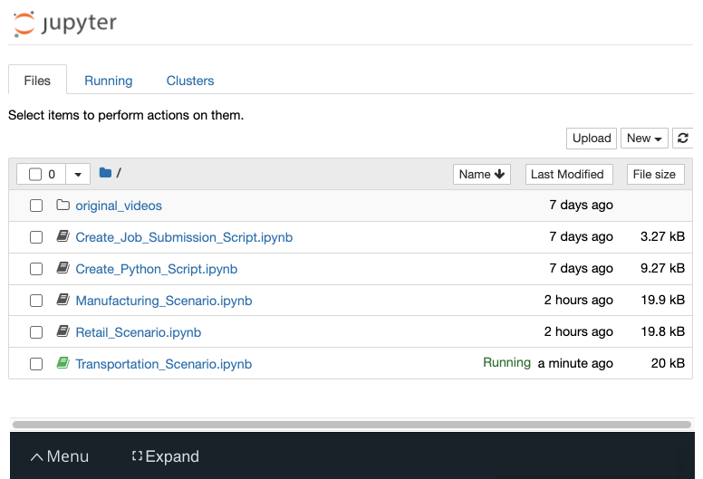

# Testing Your Hardware

Now that you have an initial hypothesis about what hardware might work for the client, it's time to test it and see how it performs!

Over the next several pages, you'll find notebooks where you can build out the smart queuing application and test its performance on all four different hardware types (CPU, IGPU, VPU, and FPGA) using the DevCloud.

## Shared Workspace

The next several pages each show a different Jupyter notebook for you to work on. Although these appear to be different workspaces, these notebooks—along with the files generated by your code—are all inside one shared workspace. If you click on the Jupyter icon in the upper left, you will be able to see all of the notebooks:

That means that all of your files are available, regardless of which page you're on—and that any changes you make on one page will show up on the other pages.

> ⚠️ If you use the `Reset Data` or `Get New Content` options on any of the following pages, be aware that this will reset the data in the entire shared workspace (regardless of which page you are on when you reset the data).

## Stand-Out Suggestions

Once you're done with all of the required parts of your project, you can take it a step further and tinker with a few other hardware features! You can try out these *standout suggestions*. Note that these are all optional and are *not required* to pass the project.

There are some pointers given below. These will help you implement the stand out suggestions in your project

**1. Multi-Device Plugin:** Multi-Device plugin automatically assigns inference requests to available computational devices to execute the requests in parallel. You can use the multi-device plugin available as a part of the OpenVINO toolkit. When you submit your project, leave a brief note for your reviewer letting them know how you used the plugin.

- The information or documentation on this can be found [here](https://docs.openvinotoolkit.org/latest/_docs_IE_DG_supported_plugins_MULTI.html)

**2. Heterogeneous Plugin:** The heterogeneous plugin enables computing for inference on one network on several devices. You can use OpenVINO's Hetero plugin to use a fallback device like CPU when the main prediction device fails. When you submit your project, leave a brief note for your reviewer letting them know how you used the plugin.

- More information regarding default or manual Fallback Policy can be found [here](https://docs.openvinotoolkit.org/latest/_docs_IE_DG_supported_plugins_HETERO.html)

https://classroom.udacity.com/nanodegrees/nd131/parts/aa2d6c2f-76c8-424c-93c3-95e543676e81/modules/afb609b9-e3b7-4d55-a599-ca6ed741eb87/lessons/9d5bba06-ef58-40d9-8bbe-87296afe7036/concepts/d7010ee7-29c1-45dc-a61d-08d8e491cd2f